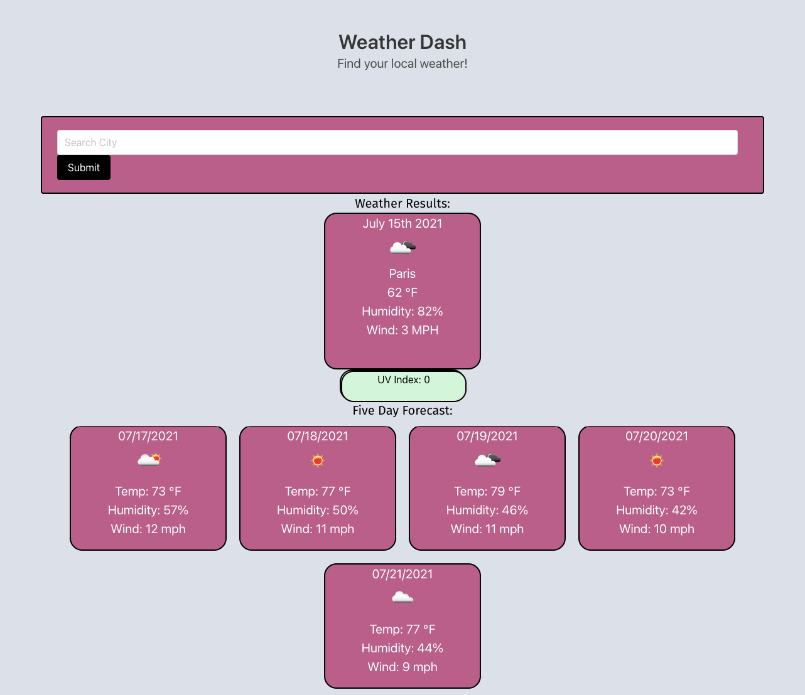

# weather-dash

This web app project is called Weather Dash. The objective was to create a web app that displays the current weather, five day forecast, and saves prior searches to the page for future use through the use of local storage. This is the first project in which I put my API fetch calling skills to use with Javascript. An Open Weather Map account was created, a key was obtained, and two calls were made to both the Current Weather Data API and One Call API. Simple styling was done with HTML and CSS. There are future plans to update this web app with cleaner styling and to weed out a few bugs. 

https://ktmac21.github.io/weather-dash/

